<p align="center">
  
</p>

<p align="center">
  <b>A Graduation Project</b><br/>
  <b>Try & Buy Team</b><br/>
  <b>Helwan University</b><br/>
  <b>Faculty of Computers and Artificial Intelligence</b><br/>
  <b>Computer Science Department</b>
</p>

## Try & Buy: AI-Powered Virtual Try-On E-Commerce Platform

## Overview

Try & Buy is a graduation project that brings the power of AI-driven virtual try-on to fashion e-commerce. The system enables users to visualize how garments will look on them before purchasing, aiming to boost confidence and reduce returns. The backend is built with Spring Boot, while the frontend uses native HTML/CSS/JS and template files.

---

## Features

- **Virtual Try-On:** Upload your photo and see yourself in different outfits using a fine-tuned IDM-VTON diffusion model.
- **Full E-Commerce Experience:** Browse, shop, add to cart, and checkout.
- **Admin Dashboard:** Manage products, inventory, and user messages.
- **Real-Time AI Inference:** Fast, realistic try-on results powered by Gradio web interface.

---

## Tech Stack

- **Backend:** Spring Boot (Java)
- **Frontend:** Native HTML, CSS, JavaScript, and template files
- **AI Model:** IDM-VTON (Diffusion-based virtual try-on)
- **Dataset:** DressCode (53,792 garments, 107,584 images)
- **Deployment:** Kaggle (GPU hosting), Gradio (web demo)

---

## Fine-Tuning Process

- **Dataset Preparation:**
  - Used the DressCode dataset (76GB+), including label maps, keypoints, and DensePose annotations.
  - Preprocessing: Mask creation, keypoint extraction, and garment segmentation.
- **Model Training:**
  - Fine-tuned the UNet component of IDM-VTON for each garment category (upper body, lower body, dresses).
  - Progressive resolution scaling (168x128 → 512x384).
  - Memory optimizations: VAE slicing/tiling, attention slicing, FP16, gradient checkpointing.
  - Losses: LPIPS, SSIM, L1, CLIP-IS.

---

## Implementation Challenges & Solutions

### Hardware Constraints

- **Challenge:** Kaggle P100 GPU memory limitations.
- **Solutions:**
  - Reduced inference steps (15 for training)
  - Dynamically scaled resolutions
  - Cleared CUDA cache frequently
  - Reduced batch size

### Dataset Management

- **Challenge:** Large dataset size and upload restrictions.
- **Solutions:**
  - Used direct download links from dataset owners
  - Signed non-commercial use agreement

### Training Stability

- **Challenge:** Preventing overfitting and crashes.
- **Solutions:**
  - Early stopping
  - Frequent checkpointing

---

## Deployment

### Environment Setup

Deploying the IDM-VTON model for virtual try-on requires a user-friendly interface and scalable infrastructure. This project uses:

- **Kaggle:** For hosting the model and datasets (free GPU, pre-installed PyTorch/Diffusers)
- **Gradio:** For building a web demo interface (easy Python API, supports image upload/output)

#### Steps:

1. **Set up the environment:**
   - Download required libraries
   - Import dependencies
2. **Upload the model**
3. **Set the model in inference mode**
4. **Create API functions**
5. **Create the Gradio API**
6. **Integrate with the web interface**

---

## Getting Started

### Prerequisites

- Java 11+ (for Spring Boot backend)
- Python 3.8+ (for AI/Gradio demo)
- Kaggle account (for GPU access)
- **No Node.js required for frontend** — simply open the HTML files in a browser or serve them with any static file server.

### Backend Setup (Spring Boot)

1. Clone the repository:
   ```bash
   git clone <repo-url>
   cd shop
   ```
2. Build and run the backend:
   ```bash
   ./mvnw spring-boot:run
   ```

### Frontend Setup

No separate setup is required for the frontend. Once the backend is running, static HTML files are served automatically by Spring Boot.

- Access the application in your browser at:
  `http://localhost:8081/login.html`
  (or any other HTML file in `src/main/resources/static`)

---

## Experimental Results

### 1. Quantitative Evaluation

Our fine-tuned UNet achieved impressive results across multiple metrics:

| Category   | LPIPS (↓) | SSIM (↑) | CLIP-IS (↑) | FID (↓) |
| ---------- | --------- | -------- | ----------- | ------- |
| Upper Body | 0.02828   | 0.9496   | 0.9804      | 4.022   |
| Lower Body | 0.03110   | 0.9480   | 0.9818      | 3.706   |
| Dresses    | 0.06687   | 0.8907   | 0.9770      | 4.488   |

**Legend:**

- ↓ = Lower is better
- ↑ = Higher is better

These metrics demonstrate the effectiveness of our UNet fine-tuning approach, with particularly strong performance in the upper and lower body categories.

#### Metric Definitions

- **LPIPS (Learned Perceptual Image Patch Similarity):** Measures perceptual similarity between images using deep features (lower is better).
- **SSIM (Structural Similarity Index):** Evaluates perceived image quality based on structure (higher is better).
- **CLIP-IS (CLIP Image Similarity):** Measures semantic similarity between generated and target images using CLIP embeddings (higher is better).
- **FID (Fréchet Inception Distance):** Evaluates quality/diversity of generated images compared to real images (lower is better).

By focusing our fine-tuning efforts specifically on the UNet component with these specialized techniques, we achieved high-quality virtual try-on results while maintaining computational efficiency within Kaggle's constraints.

---

## Visual Results

Below are side-by-side comparison images showing the original garment (left) and the model-generated try-on result (right) for each category:

### 1. Upper Body

<p align="center">
  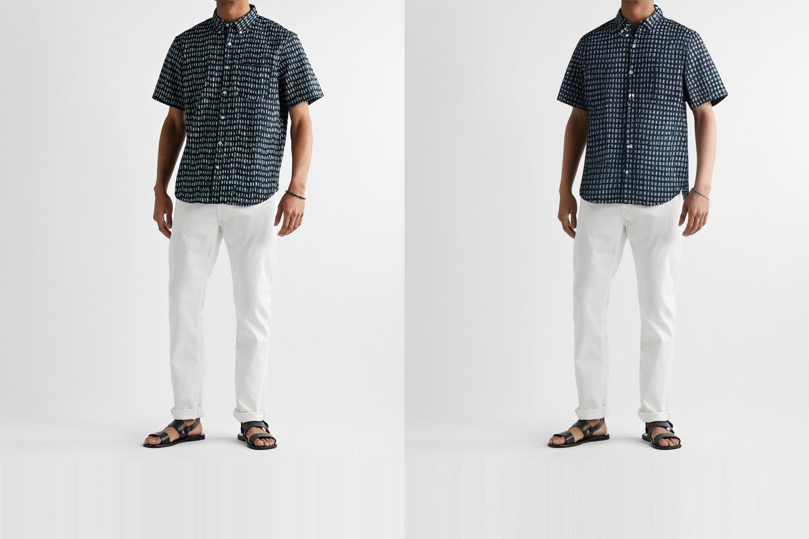
  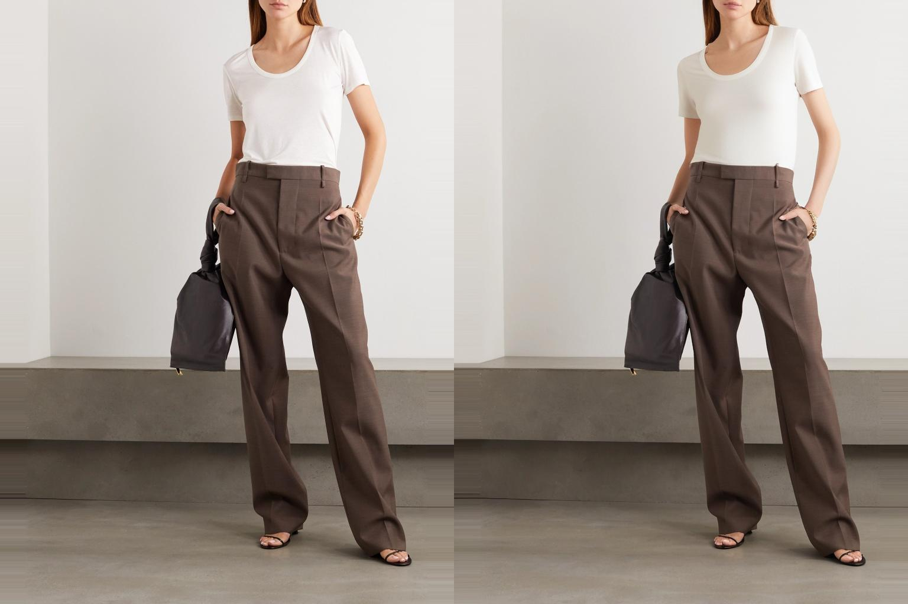
   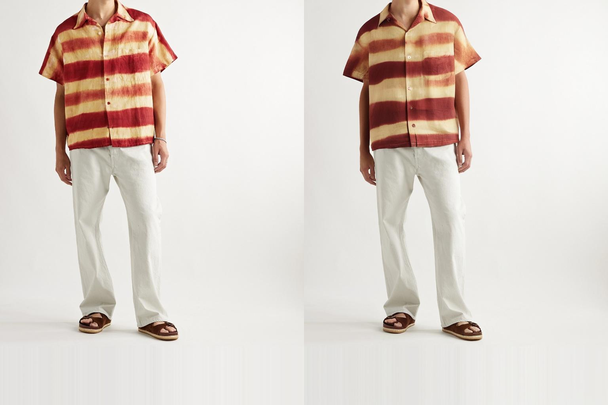
</p>

### 2. Dresses

<p align="center">
  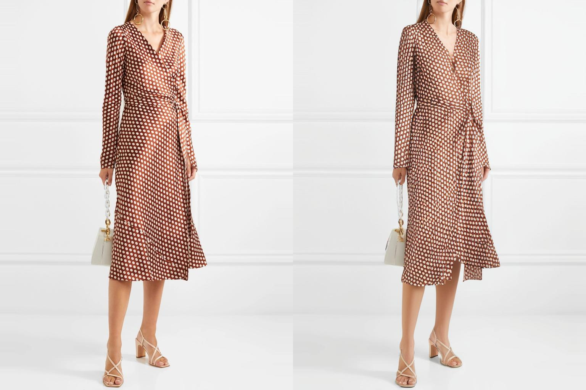
  
  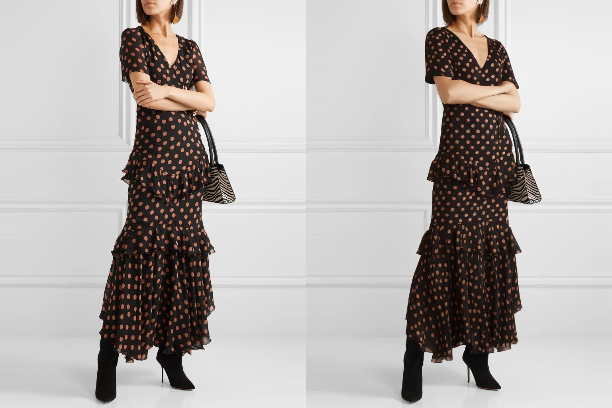
  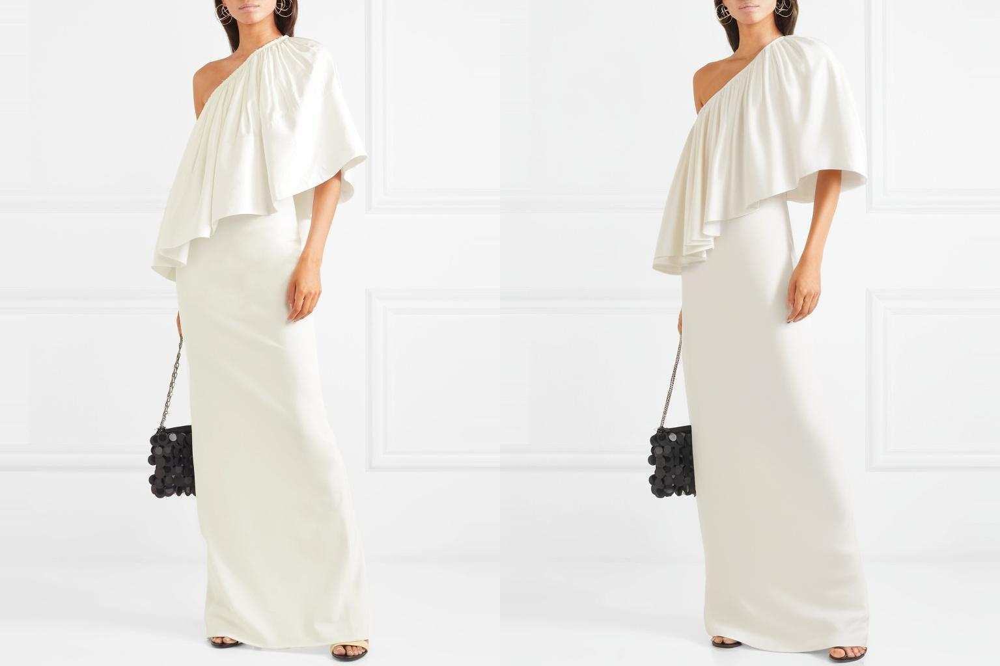
  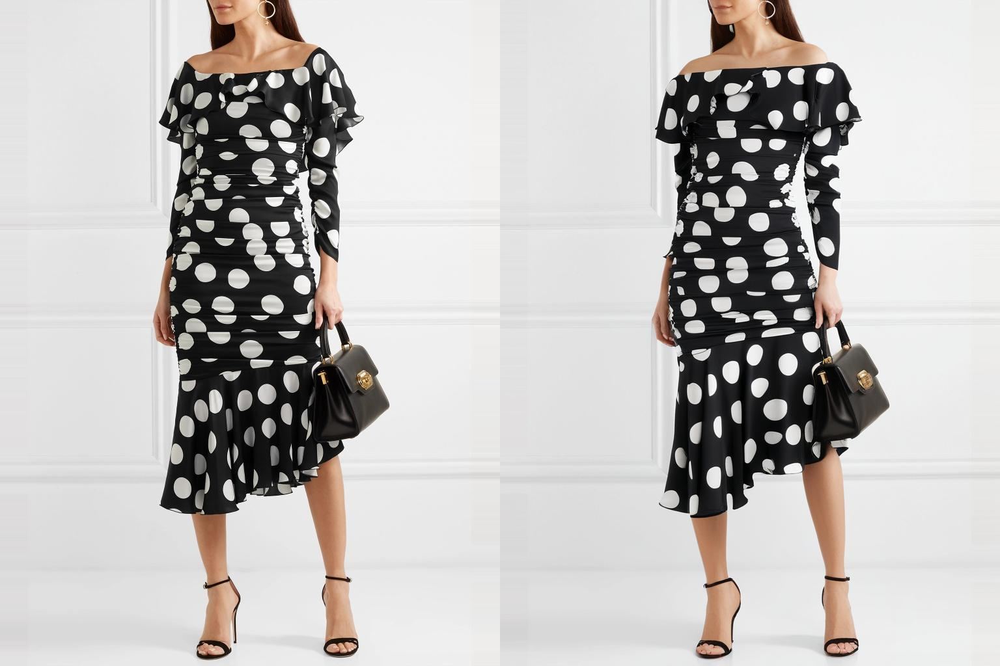
</p>

### 3. Lower Body

<p align="center">
  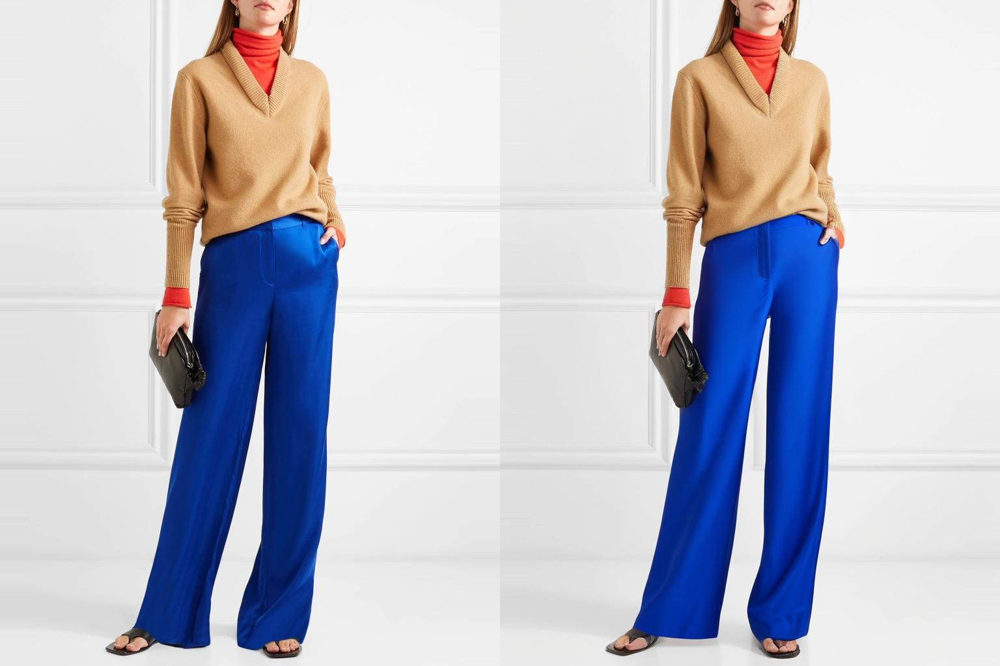
  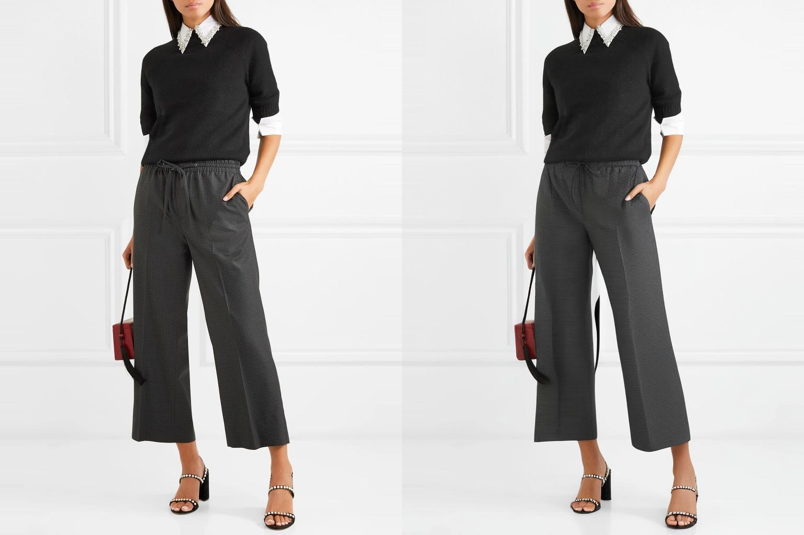
  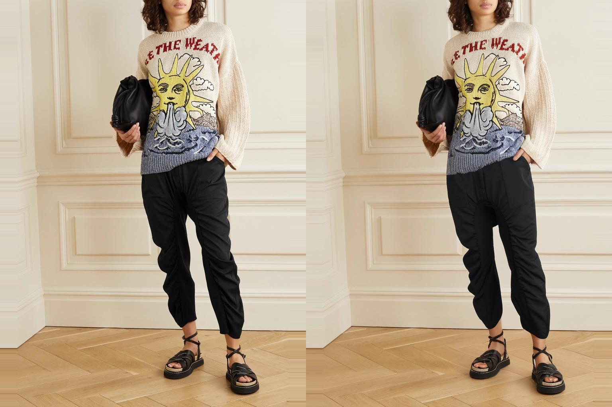
  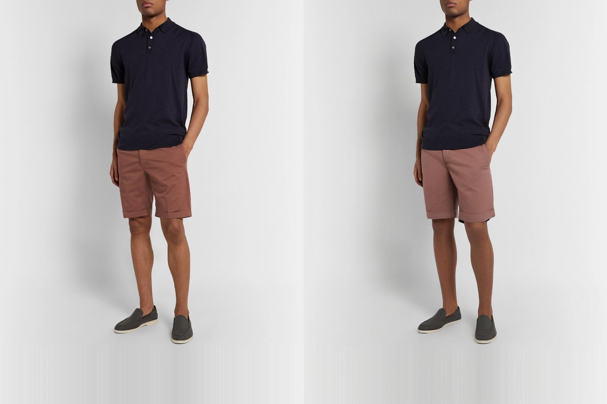
  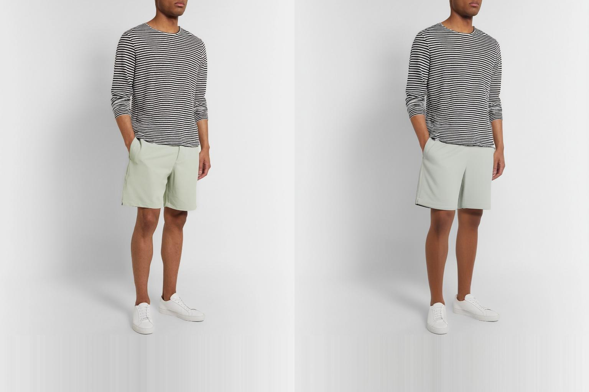
  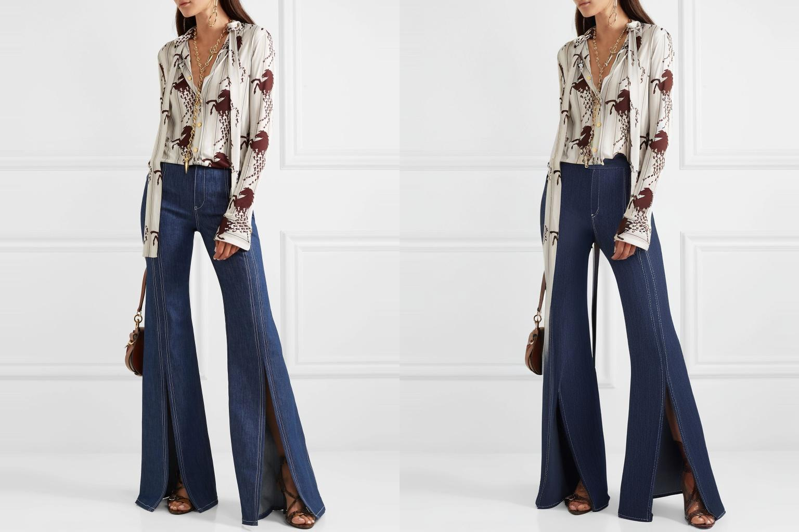
  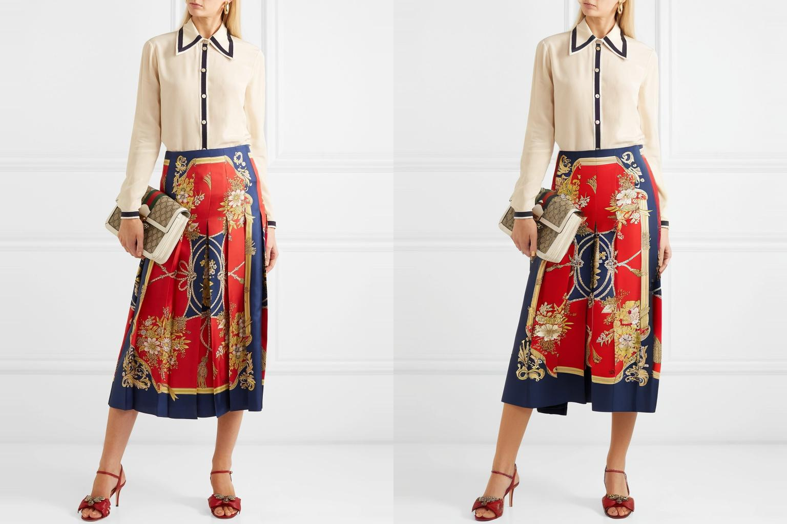
</p>

These visual comparisons demonstrate our model's ability to handle different
garment types, maintain texture fidelity, and properly align garments to diverse
body poses. Particularly notable is the model's performance on complex
patterns and graphics, which previous approaches struggled to preserve.

---

## Contributing

Contributions are welcome! Please open an issue or submit a pull request for improvements, bug fixes, or new features.

---

## License

This project is for academic/non-commercial use only. Please respect the DressCode dataset license and terms of use.

---

## Contact

For questions or collaboration, please contact:

- Nadia Talaat (Machine Learning Engineer)
- nadiatalaat03@gmail.com

---

## Team

- **Nadia Talaat** – Machine Learning Engineer
- **Abdallah Ragab** – Machine Learning Engineer
- **Abdelrahman Magdy** – Backend Developer
- **Amira Hasan** – Backend Developer
- **Nada Mohamed** – Backend Developer
- **Shawqy Hussien** – Frontend Developer

---
